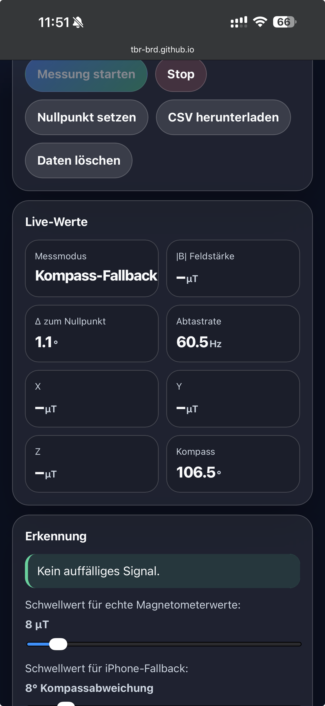
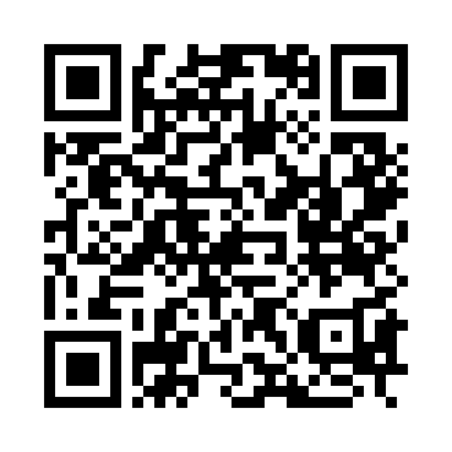

# Magnetfeld-Messung iPhone

Lokale Webapp für Magnetfeld-/Kompassmessung im Browser.

## Hinweis zur Messung

Auf dem iPhone liefert Safari aktuell keine echten Magnetometerwerte in µT.  
Die Webapp nutzt deshalb dort nur den Kompasswinkel als Fallback.

Angezeigt werden auf dem iPhone daher keine X/Y/Z-Magnetfeldwerte, sondern nur Änderungen im Kompasswinkel.  
Das kann für einfache Störungstests genutzt werden, ist aber keine echte Magnetfeldmessung.



## Android / T-Phone 3

Auf Android-Geräten wie dem T-Phone ist die Nutzung über den Kompass-/Orientierungsmodus wahrscheinlich möglich.

Echte Magnetometerwerte in µT über die Web-Magnetometer-API sind in Chrome für Android aktuell nicht zuverlässig verfügbar, da die API standardmäßig deaktiviert bzw. experimentell ist.

T-Phone wurde noch nicht praktisch getestet.

## Start

Auf dem iPhone diesen Link öffnen:
https://tbr-brd.github.io/magnetfeld-messung-iphone/

https lokal:
```bash
python3 -m http.server 8080
```

Für iPhone-Sensoren: HTTPS nutzen.

## Privacy

Keine Serverübertragung. CSV bleibt lokal.

<br>
<a href="https://www.buymeacoffee.com/thoralf.brandt" target="_blank">
  
</a>
<br>

Auf dem iPhone öffnen


